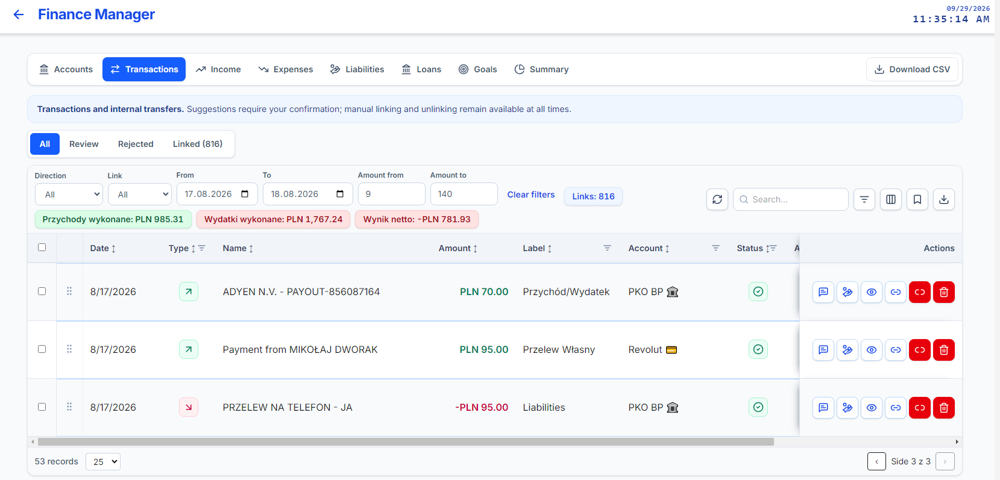
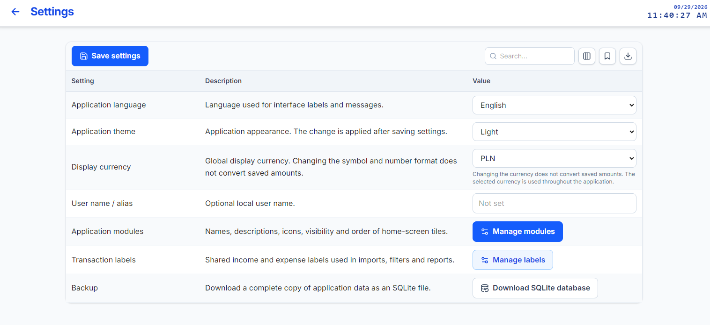
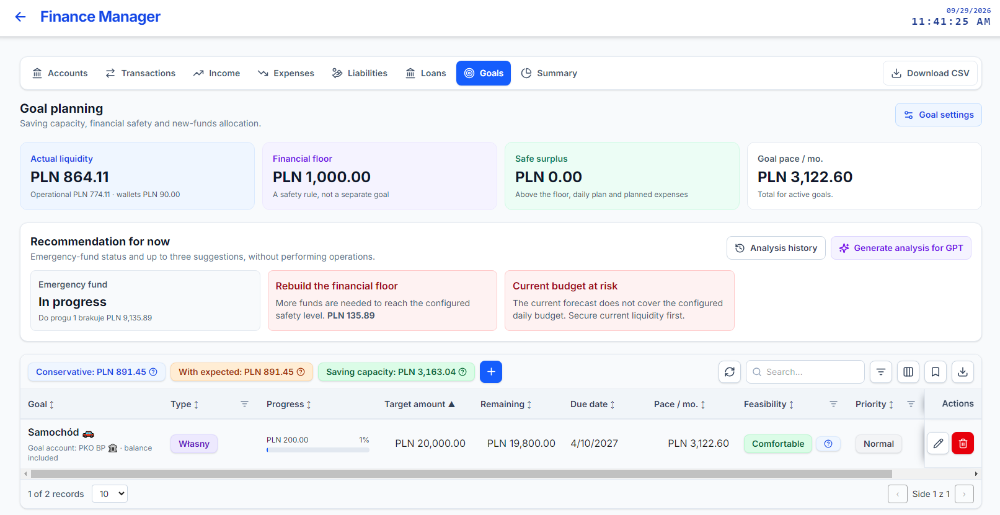
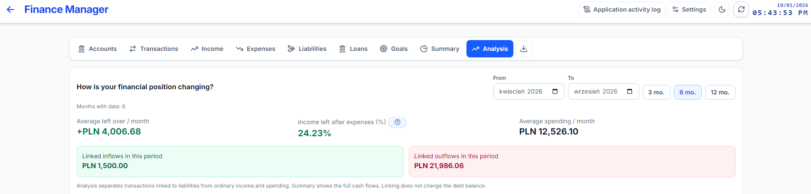
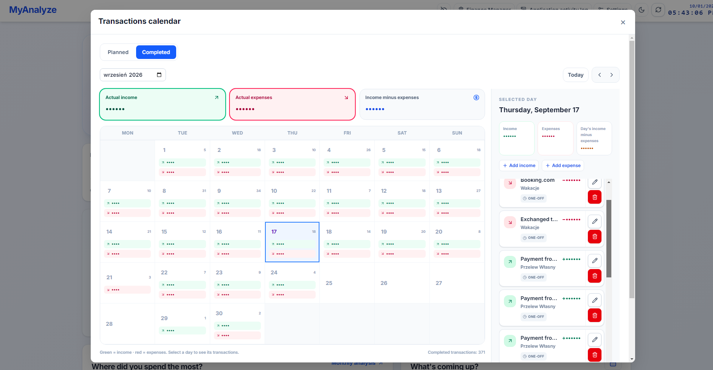
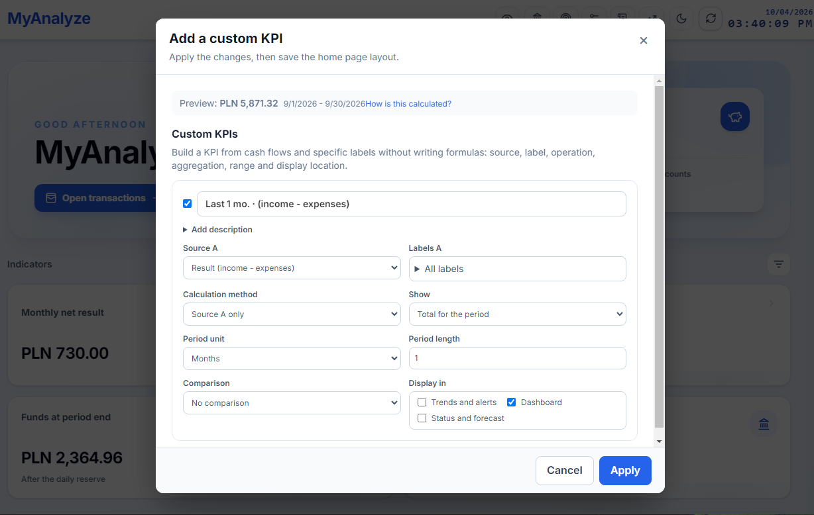
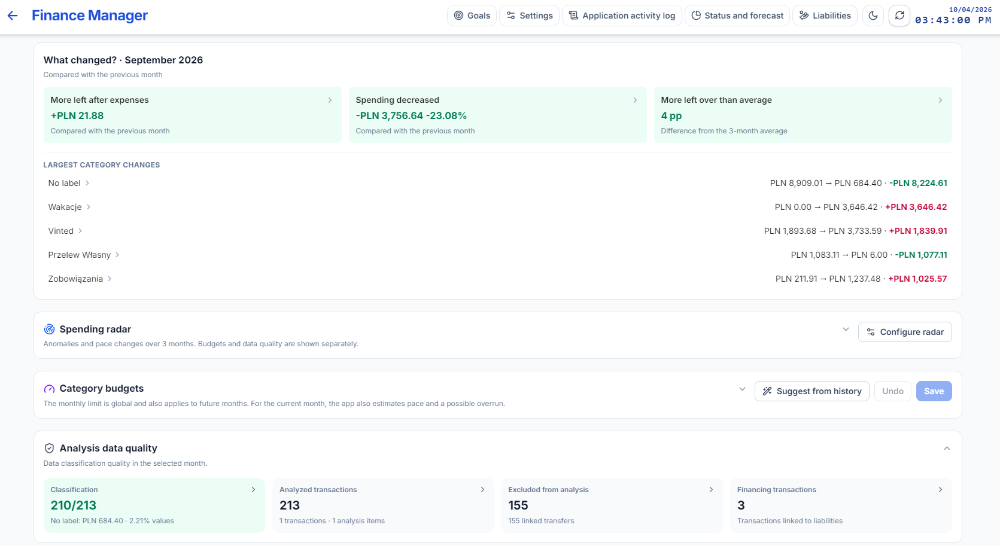

# MyAnalyze story

MyAnalyze started as a small offline tool for keeping a clear view of household money. Each release expanded the same idea: keep plans, completed transactions, account balances and analysis understandable, while leaving the data under the user's control.

## 1.4 · The foundation

The first public portfolio release introduced the local SQLite desktop application, plan-versus-actual tracking, monthly analytics, CSV statement import, accounts, credit cards, liabilities, loans and recurring transactions.

[View the 1.4 release](https://github.com/987p2jnkrb-wq/MyAnalyze-releases/releases/tag/v1.4.0)

## 1.5 · A more useful daily tool

The application gained Polish and English interfaces, a global display currency, configurable goal allocation, PDF statement import with preview and correction, and faster forecasts for larger histories.

[View the 1.5 release](https://github.com/987p2jnkrb-wq/MyAnalyze-releases/releases/tag/v1.5.0)

## 1.6 · Analysis becomes a first-class feature

Analytical splits, transaction notes, clearer filters and summaries, product history, improved duplicate and transfer matching, and more reliable forecasts made it possible to investigate the story behind a number without changing the original bank transaction.

[View the 1.6 release](https://github.com/987p2jnkrb-wq/MyAnalyze-releases/releases/tag/v1.6.0)

## 1.7 · From manager to dashboard

The Welcome page became a practical dashboard. The calendar made daily operations easier to review, while the Analysis module brought period comparisons and cash-flow interpretation into one place.

[View the 1.7 release](https://github.com/987p2jnkrb-wq/MyAnalyze-releases/releases/tag/v1.7.0)

## 1.8 · Customization and resilience

Version 1.8 introduced custom KPIs, the spending radar, product documents, full backup and restore, manual posting undo and a first mobile usability pass.

[View the 1.8 release](https://github.com/987p2jnkrb-wq/MyAnalyze-releases/releases/tag/v1.8.0)

## 1.9 · The current release

The current release brings the pieces together: shared credit and liability lifecycle rules, better month navigation and charts, multi-file product documents, configurable KPIs and radar, complete backup and restore, and improved mobile layouts.

[Download 1.9.0](https://github.com/987p2jnkrb-wq/MyAnalyze-releases/releases/tag/v1.9.0)
